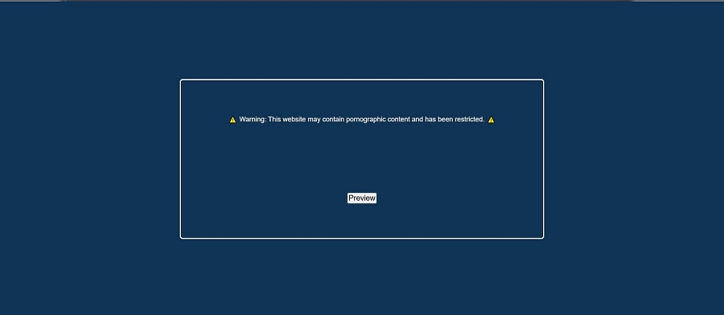
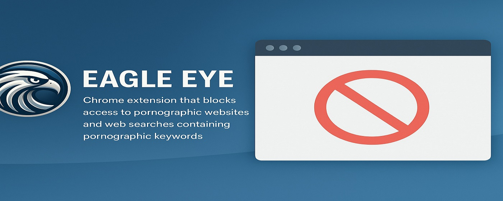

# 🦅 Eagle Eye - Content Safety Extension  

**A browser extension that automatically detects and blocks adult content in real-time, keeping your browsing experience safe and private.**  

  
  

---

## 🔍 What It Does  
Eagle Eye intelligently analyzes web pages and search queries in real time. When adult content is detected:  
- 🚫 **Instantly hides the webpage**  
- ⚠️ **Displays a clear warning message**  
- ⏳ **Allows temporary 10-second previews** (optional)  
- 🔒 **100% local processing** (no data sent to servers)  

▶️ [Watch Video Demo](https://www.youtube.com/embed/6e0ihktxP1g)  

---

## ✨ Key Features  
✅ **Real-time detection** of adult content  
✅ **Privacy-focused** - no tracking or logging  
✅ **User-controlled** with preview option  
✅ **Lightweight** - minimal performance impact  

---

## 🛡️ Privacy First  
We **never** collect, store, or transmit your browsing data. All analysis happens locally in your browser.  

---

## ⚙️ Installation  
1. [Download from Chrome Web Store](INSERT_LINK_HERE)  
2. Click "Add to Chrome"  
3. Browse safely!  

---

## 📬 Support  
Contact us at: [eagle_eye support mail](mailto:daniel30chromdev@gmail.com)  

---

## 🏗️ Built With  
- HTML/CSS  
- JavaScript  
- Chrome Extension API  

---

## 🌟 Why Choose Eagle Eye?  
> "Unlike other filters, Eagle Eye respects your privacy while giving you control over your browsing experience."  

---

© 2025 [Daniel Mabia](https://github.com/princedan-123) | [GitHub Repo](#)  

  

---

### 📌 Pro Tip  
For best results, keep the extension updated and report any undetected sites via email!  

---

**Preview:**  
  

*Note: Thumbnail follows YouTube's recommended 1280×720px resolution for optimal display.*  

---

🚀 **Ready to take control of your browsing?** [Install Now](#)